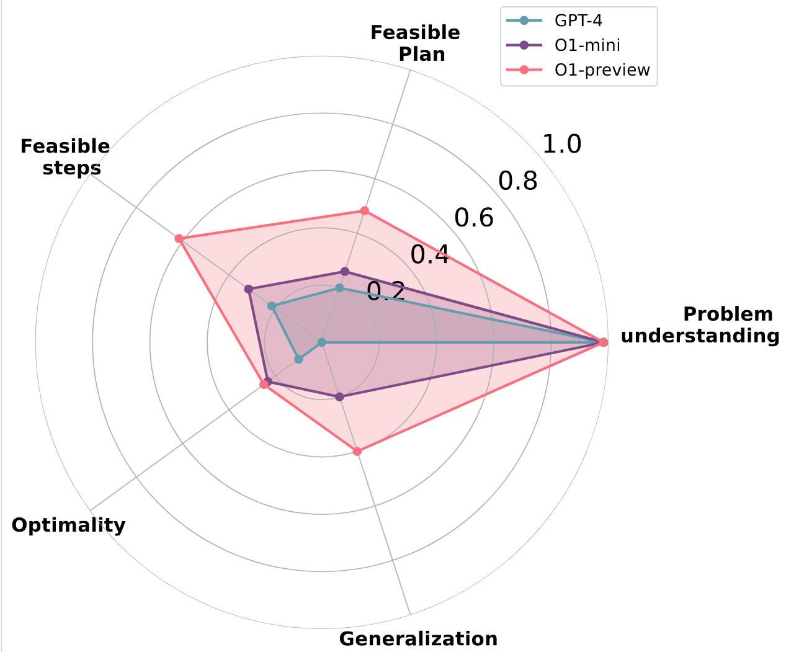
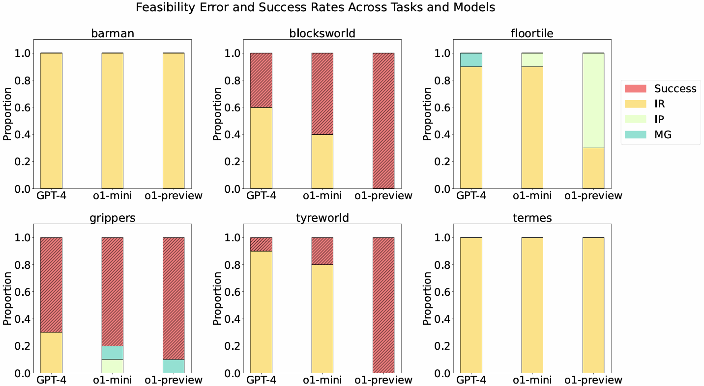

# On The Planning Abilities of OpenAI's o1 Models: Feasibility, Optimality, and Generalizability

<p align="center">
    <a href="https://kevin-2017.github.io/">Kevin Wang *</a>
    ·
    <a href="https://ljb121002.github.io/">Junbo Li *</a>
    ·
    <a href="https://neel1302.github.io/">Neel P. Bhatt *</a>
    ·
    <a href="https://scholar.google.com/citations?user=34s2YS0AAAAJ&hl=en">Yihan Xi</a>
    <br>
    .
    <a href="https://www.cs.utexas.edu/~lqiang/">Qiang Liu</a>
    .
    <a href="https://oden.utexas.edu/people/directory/ufuk--topcu/">Ufuk Topcu</a>
    .
    <a href="https://vita-group.github.io/group.html">Atlas Wang</a>
    .
    
  </p>
      <em>*Equal contribution and co-first authors</em>

<h3 align="center"><a href="https://arxiv.org/abs/2409.19924">arXiv</a> | <a href="">Project Page(coming soon)</a> | <a href="">more examples + evaluations(coming soon)</a> </h3>

<p align="center">
  <a href="">
    
    
  </a>
</p>
<p>
We evaluated the GPT4 and o1 on planning tasks, highlighting their strength in problem understanding and identifying challenges in spatial reasoning and generalization.
</p>

## TODO List
We will update the detailed information and share access to more files soon. 
- [x] Release detailed experiments evaluation
- [ ] Project page
- [ ] Release automoation evaluation script (This would take a while) 


## The File Hierarchy:
```
OpenAI's o1 Models
  └─results
     └─barman (the domains)
     ...
     └─tyreworld
        └─p_.pddl.prompt (the prompt we used for experiments, including the domain and problem in natural language)
        └─p_.pddl.gpt4 (GPT4 results to the prompt)
        └─p_.pddl.o1-mini (O1-mini results to the prompt)
        └─p_.pddl.o1-preivew(o1-preview results to the prompt)
        └─random.py(only in randomized example, this encode the problem with random symbol)
  └─visual (this would include more visual examples and graphic)
  └─scripts (scripts used to generate files, and update in the future)

```
The detailed [experiment results](https://docs.google.com/spreadsheets/d/1QPrIUQJQukDYdV_ZCtsRmzeUwwhHthLxAkXaLcfho-0/edit?gid=0#gid=0)

# Citation
If you find our paper useful or interesting, please consider giving a star ⭐ and citing the following paper 📝.

```bibtex
@misc{wang2024planningabilitiesopenaiso1,
      title={On The Planning Abilities of OpenAI's o1 Models: Feasibility, Optimality, and Generalizability}, 
      author={Kevin Wang and Junbo Li and Neel P. Bhatt and Yihan Xi and Qiang Liu and Ufuk Topcu and Zhangyang Wang},
      year={2024},
      eprint={2409.19924},
      archivePrefix={arXiv},
      primaryClass={cs.AI},
      url={https://arxiv.org/abs/2409.19924}, 
}
```

# Acknowledgements
The basic prompts are from llm+p available at [this GitHub repository](https://github.com/Cranial-XIX/llm-pddl). We thank all the authors for their great work and repos. 

There are also some concurrent works that were released recently or will be released soon:
- [LLMs Still Can't Plan; Can LRMs? A Preliminary Evaluation of OpenAI's o1 on PlanBench](https://www.arxiv.org/abs/2409.13373)
- [Embodied Agent Interface: A Single Line to Evaluate LLMs for Embodied Decision Making](https://embodied-agent-interface.github.io/)

